# VBase RCE Engine

A lightweight, secure Remote Code Execution (RCE) engine for VBase

## Features

- **Multiple Language Support**: Python, JavaScript (Node.js), C, C++, Java
- **Lightweight**: Alpine-based runner containers
- **Secure by Design**: Defense-in-depth with multiple security layers
- **Simple Deployment**: Single docker-compose command

## Supported Languages

| Language   | Version | Aliases                        |
|------------|---------|--------------------------------|
| Python     | 3.12.0  | python3, py                    |
| JavaScript | 20.0.0  | js, node, node-js              |
| C          | 13.2.0  | gcc                            |
| C++        | 13.2.0  | cpp, g++, cplusplus            |
| Java       | 21.0.0  | jdk                            |

## Quick Start

### 1. Build and Start

```bash
# Build all images and start the API
docker-compose up --build -d

# View logs
docker-compose logs -f rce-api
```

### 2. Test the API

```bash
# List available runtimes
curl -H "X-API-Key: your-api-key" http://localhost:8000/api/v2/runtimes

# Execute Python code
curl -X POST http://localhost:8000/api/v2/execute \
  -H "X-API-Key: your-api-key" \
  -H "Content-Type: application/json" \
  -d '{
    "language": "python",
    "version": "3.12.0",
    "files": [{"content": "print(\"Hello, World!\")"}]
  }'

# Execute JavaScript
curl -X POST http://localhost:8000/api/v2/execute \
  -H "X-API-Key: your-api-key" \
  -H "Content-Type: application/json" \
  -d '{
    "language": "javascript",
    "version": "20.0.0",
    "files": [{"content": "console.log(\"Hello from Node.js!\")"}]
  }'

# Execute C++ with compilation
curl -X POST http://localhost:8000/api/v2/execute \
  -H "X-API-Key: your-api-key" \
  -H "Content-Type: application/json" \
  -d '{
    "language": "cpp",
    "version": "13.2.0",
    "files": [{"content": "#include <iostream>\nint main() { std::cout << \"Hello C++!\" << std::endl; return 0; }"}]
  }'
```

> **Note**: If `VBASE_API_KEY` is not set in `.env`, authentication is disabled (development mode).

## API Endpoints

### GET /api/v2/runtimes

List all available language runtimes.

**Response:**
```json
[
  {
    "language": "python",
    "version": "3.12.0",
    "aliases": ["python3", "py"]
  }
]
```

### POST /api/v2/execute

Execute code in an isolated container.

**Request:**
```json
{
  "language": "python",
  "version": "3.12.0",
  "files": [
    {
      "name": "main.py",
      "content": "print('Hello!')"
    }
  ],
  "stdin": "",
  "args": [],
  "run_timeout": 10000,
  "run_memory_limit": -1
}
```

**Response:**
```json
{
  "language": "python",
  "version": "3.12.0",
  "run": {
    "stdout": "Hello!\n",
    "stderr": "",
    "output": "Hello!\n",
    "code": 0,
    "signal": null
  }
}
```

## Architecture

### How Code Execution Works

```
┌────────────────────────────────────────────────────────────────┐
│                         Docker Host                            │
├────────────────────────────────────────────────────────────────┤
│                                                                │
│  ┌──────────────────┐        ┌──────────────────────────────┐  │
│  │  Docker Socket   │◄──────►│   docker-socket-proxy        │  │
│  │  /var/run/...    │   RO   │   (restricted API access)    │  │
│  └──────────────────┘        └──────────────┬───────────────┘  │
│                                             │ TCP :2375        │
│                                             ▼                  │
│  ┌──────────────────────────────────────────────────────────┐  │
│  │                    rce-api (FastAPI)                     │  │
│  │                    Runs as: appuser (UID 1000)           │  │
│  │                                                          │  │
│  │  1. Receives code execution request                      │  │
│  │  2. Writes code to shared volume                         │  │
│  │  3. Creates runner container via socket proxy            │  │
│  │  4. Waits for execution, returns output                  │  │
│  │  5. Cleans up temp files                                 │  │
│  └────────────────────────┬─────────────────────────────────┘  │
│                           │                                    │
│                           ▼                                    │
│  ┌──────────────────────────────────────────────────────────┐  │
│  │              Named Volume: vbase-code-files              │  │
│  │              (shared between API and runners)            │  │
│  └────────────────────────┬─────────────────────────────────┘  │
│                           │ Read-only mount                    │
│                           ▼                                    │
│  ┌──────────────────────────────────────────────────────────┐  │
│  │                 Runner Container                         │  │
│  │                 (python/node/c/cpp/java)                 │  │
│  │                 Runs as: runner (UID 1001)               │  │
│  │                                                          │  │
│  │  - Network disabled                                      │  │
│  │  - Read-only rootfs + tmpfs                              │  │
│  │  - Memory/CPU/PID limits                                 │  │
│  │  - All capabilities dropped                              │  │
│  └──────────────────────────────────────────────────────────┘  │
│                                                                │
└────────────────────────────────────────────────────────────────┘
```

### Volume Sharing Mechanism

Code files are shared between the API container and runner containers using a Docker named volume:

1. **API Container** mounts `vbase-code-files` at `/tmp/vbase-rce`
2. **API** writes code to `/tmp/vbase-rce/exec-{random}/main.{ext}`
3. **Files are made world-readable** (`chmod 755` dir, `chmod 644` files)
4. **Runner Container** mounts same volume at `/code-volume` (read-only)
5. **Runner** executes `/code-volume/exec-{random}/main.{ext}`
6. **Cleanup**: Temp directory deleted after execution

This approach works in containerized environments (Azure Container Apps, AWS ECS, etc.) where bind mounts to host paths are not available.

### Privilege Dropping (API Container)

The API container uses a two-stage startup:

1. **Stage 1 (root)**: `entrypoint.sh` runs as root to fix volume permissions
2. **Stage 2 (appuser)**: Uses `gosu` to drop to `appuser` (UID 1000) and run uvicorn

```bash
# entrypoint.sh flow:
if [ "$(id -u)" = "0" ]; then
    chown -R appuser:appuser /tmp/vbase-rce
    exec gosu appuser "$0" "$@"  # Re-exec as appuser
fi
exec "$@"  # Run uvicorn
```

---

## Security Architecture

vbase-rce implements defense-in-depth with multiple security layers to safely execute untrusted code.

### Security Measures Overview

| Layer | Measure | Defends Against | Implementation |
|-------|---------|-----------------|----------------|
| **API** | API Key Authentication | Unauthorized access, abuse | `X-API-Key` header validation |
| **API** | Non-root Container | Privilege escalation | Runs as `appuser` (UID 1000) |
| **API** | Concurrent Job Limit | Resource exhaustion, DoS | `asyncio.Semaphore` (default: 5) |
| **Docker** | Socket Proxy | Full Docker API exposure | `tecnativa/docker-socket-proxy` |
| **Container** | Memory Limit | Memory bombs, OOM attacks | 128 MB default, 256 MB max |
| **Container** | CPU Limit | CPU mining, infinite loops | 50% of one CPU core |
| **Container** | Execution Timeout | Infinite loops, hanging | 10s default, 30s max |
| **Container** | Network Disabled | Data exfiltration, C2 | `network_disabled: true` |
| **Container** | Read-only Filesystem | Persistent malware | `read_only: true` + tmpfs |
| **Container** | Process Limit | Fork bombs | Max 64 processes (PIDs) |
| **Container** | Dropped Capabilities | Privilege escalation | `cap_drop: ALL` |
| **Container** | No New Privileges | SUID/SGID exploits | `no-new-privileges: true` |
| **Code** | Command as List | Shell injection | No shell interpolation |

### Detailed Security Layers

#### 1. API Key Authentication
Protects the API from unauthorized access. Without a valid key, requests are rejected.

```bash
# Enable by setting in .env
VBASE_API_KEY=your-secure-key-here
```

- **401 Unauthorized**: Missing API key
- **403 Forbidden**: Invalid API key
- **Development mode**: Leave `VBASE_API_KEY` empty to disable auth

#### 2. Docker Socket Proxy
Instead of mounting the Docker socket directly (which grants root-level host access), we use a restricted proxy.

```yaml
# Only these Docker API endpoints are allowed:
CONTAINERS=1  # Create/manage containers
IMAGES=1      # List images
VOLUMES=1     # Mount shared code volume
POST=1        # Required for container creation
VERSION=1     # API version check
PING=1        # Health check

# Everything else is blocked:
EXEC=0, NETWORKS=0, BUILD=0, SWARM=0, etc.
```

**Defends against**: If the API is compromised, attackers cannot:
- Execute commands in other containers
- Access host filesystem via volumes
- Build malicious images
- Modify Docker networks

#### 3. Non-root API Container
The API server runs as an unprivileged user, not root.

```dockerfile
USER appuser  # UID 1000
```

**Defends against**: Even if an attacker escapes the application, they have limited privileges.

#### 4. Concurrent Job Limiting
Prevents resource exhaustion from too many simultaneous executions.

```python
# Default: 5 concurrent jobs
self.semaphore = asyncio.Semaphore(MAX_CONCURRENT_JOBS)
```

**Configurable via environment**:
```bash
MAX_CONCURRENT_JOBS=5  # Adjust based on server capacity
```

**Defends against**:
- Accidental DoS from frontend bugs
- Intentional resource exhaustion attacks
- Server overload during traffic spikes

#### 5. Container Resource Limits

Each code execution container is heavily restricted:

```python
# Memory: Hard limit prevents memory bombs
mem_limit: "128m"
memswap_limit: "128m"  # No swap allowed

# CPU: Prevents crypto mining / CPU exhaustion
nano_cpus: 500000000  # 0.5 CPU cores

# Processes: Prevents fork bombs
pids_limit: 64

# Time: Kills runaway processes
timeout: 10  # seconds (max: 30)
```

#### 6. Network Isolation
Containers have no network access whatsoever.

```python
network_disabled: true
```

**Defends against**:
- Data exfiltration (stealing secrets)
- Command & control communication
- Cryptocurrency mining pools
- Attacking other services

#### 7. Filesystem Restrictions
Root filesystem is read-only with minimal writable tmpfs.

```python
read_only: true
tmpfs: {
    "/tmp": "size=64m,mode=1777,exec",
    "/home/runner": "size=64m,mode=1777,exec"
}
```

**Defends against**:
- Persistent malware
- File-based attacks
- Disk filling attacks (tmpfs has size limit)

#### 8. Capability Dropping
All Linux capabilities are dropped.

```python
cap_drop: ["ALL"]
security_opt: ["no-new-privileges:true"]
```

**Defends against**:
- Privilege escalation
- SUID/SGID binary exploitation
- Container escape attempts

#### 9. Shell Injection Prevention
Commands are passed as lists, not shell strings.

```python
# Safe: passed directly to exec
command = ["python3", "/code/main.py"]

# NOT used: vulnerable to injection
command = f"python3 /code/{filename}"  # ❌
```

### Security Configuration

All security settings are centralized in `api/config.py`:

```python
@dataclass
class SecurityConfig:
    default_memory_limit: str = "128m"
    max_memory_limit: str = "256m"
    default_timeout: int = 10
    max_timeout: int = 30
    pids_limit: int = 64
    network_disabled: bool = True
    read_only_rootfs: bool = True
    cap_drop: List[str] = ["ALL"]
    # ... more settings
```

### Environment Variables

| Variable | Default | Description |
|----------|---------|-------------|
| `VBASE_API_KEY` | *(empty)* | API key for authentication (empty = disabled) |
| `MAX_CONCURRENT_JOBS` | `5` | Maximum simultaneous code executions |
| `DOCKER_HOST` | `tcp://docker-socket-proxy:2375` | Docker API endpoint |
| `CODE_FILES_PATH` | `/tmp/vbase-rce` | Directory for temporary code files (must match volume mount) |
| `CODE_FILES_VOLUME` | `vbase-rce_vbase-code-files` | Docker volume name for code sharing |
| `APP_USER` | `appuser` | User to run the API as (after privilege drop) |

## Project Structure

```
vbase-rce/
├── api/
│   ├── Dockerfile       # API server container
│   ├── entrypoint.sh    # Privilege drop script (gosu)
│   ├── main.py          # FastAPI application
│   ├── models.py        # Pydantic models
│   ├── config.py        # Runtime & security configuration
│   ├── executor.py      # Code execution engine (volume handling)
│   └── requirements.txt # Python dependencies
├── runners/
│   ├── python/Dockerfile
│   ├── node/Dockerfile
│   ├── c/Dockerfile
│   ├── cpp/Dockerfile
│   └── java/Dockerfile
├── docker-compose.yml
├── pyproject.toml
└── README.md
```

## Development

### Run locally without Docker (for API development)

```bash
# Create virtual environment
python -m venv venv
source venv/bin/activate

# Install dependencies
pip install -r api/requirements.txt

# Run the API (requires Docker daemon running)
cd api
uvicorn main:app --reload --host 0.0.0.0 --port 8000
```

### Build individual runner images

```bash
docker build -t vbase-python-runner ./runners/python
docker build -t vbase-node-runner ./runners/node
docker build -t vbase-c-runner ./runners/c
docker build -t vbase-cpp-runner ./runners/cpp
docker build -t vbase-java-runner ./runners/java
```

## Deployment

### DigitalOcean / Any VPS

1. Create a Droplet/VPS with Docker pre-installed
2. Clone this repository
3. Configure environment variables
4. Run `docker-compose up --build -d`
5. Configure firewall to allow port 8000
6. (Optional) Set up a reverse proxy with HTTPS

```bash
# On your server
git clone <your-repo-url> vbase-rce
cd vbase-rce

# Generate and set API key
echo "VBASE_API_KEY=$(openssl rand -hex 32)" >> .env

# Optionally adjust concurrent jobs based on server resources
echo "MAX_CONCURRENT_JOBS=5" >> .env

# Start the service
docker-compose up --build -d

# Verify it's running
curl -H "X-API-Key: $(grep VBASE_API_KEY .env | cut -d= -f2)" \
  http://localhost:8000/api/v2/runtimes
```

### Azure Container Apps / AWS ECS / GCP Cloud Run

For containerized cloud platforms:

1. **Build and push images** to a container registry (ACR, ECR, GCR)
2. **Deploy with docker-compose** or convert to platform-specific config
3. **Important**: The named volume `vbase-code-files` must be available

```bash
# Push images to registry
docker-compose build
docker tag vbase-rce-rce-api:latest <registry>/vbase-rce-api:latest
docker tag vbase-python-runner:latest <registry>/vbase-python-runner:latest
# ... tag other runners
docker push <registry>/vbase-rce-api:latest
# ... push other images
```

**Key environment variables for cloud deployment:**
```bash
VBASE_API_KEY=<your-secure-key>
CODE_FILES_PATH=/tmp/vbase-rce
CODE_FILES_VOLUME=<your-volume-name>  # Adjust to match cloud volume naming
DOCKER_HOST=tcp://docker-socket-proxy:2375
```

> **Note**: The volume name (`CODE_FILES_VOLUME`) may need adjustment based on how your cloud platform names volumes. Check the actual volume name after deployment.

### Production Recommendations

- **Always set `VBASE_API_KEY`** in production
- Use a reverse proxy (nginx/caddy) with HTTPS
- Set `MAX_CONCURRENT_JOBS` based on your droplet's resources (1-2 per CPU core)
- Monitor with `docker-compose logs -f rce-api`
- Consider rate limiting at the reverse proxy level

---

## Diagrams

### System Architecture

```mermaid
graph TB
    subgraph "External"
        Client["🖥️ Client<br/>(Frontend/API Consumer)"]
    end

    subgraph "Docker Host"
        subgraph "Network: docker-proxy-net"
            API["📦 rce-api<br/>FastAPI Server<br/>Port 8000<br/><i>UID 1000 (appuser)</i>"]
            Proxy["🔒 docker-socket-proxy<br/>Restricted Docker API<br/>Port 2375"]
        end

        Socket[("🐳 Docker Socket<br/>/var/run/docker.sock")]
        Volume[("💾 Named Volume<br/>vbase-code-files")]

        subgraph "Runner Containers (ephemeral)"
            Python["🐍 python-runner<br/><i>UID 1001</i>"]
            Node["📗 node-runner<br/><i>UID 1001</i>"]
            C["⚙️ c-runner<br/><i>UID 1001</i>"]
            Cpp["⚙️ cpp-runner<br/><i>UID 1001</i>"]
            Java["☕ java-runner<br/><i>UID 1001</i>"]
        end
    end

    Client -->|"HTTPS :8000<br/>X-API-Key header"| API
    API -->|"TCP :2375<br/>Create containers"| Proxy
    Proxy -->|"Read-only mount"| Socket
    API -->|"Read/Write"| Volume
    Volume -->|"Read-only mount"| Python
    Volume -->|"Read-only mount"| Node
    Volume -->|"Read-only mount"| C
    Volume -->|"Read-only mount"| Cpp
    Volume -->|"Read-only mount"| Java

    classDef secure fill:#d4edda,stroke:#28a745
    classDef ephemeral fill:#fff3cd,stroke:#ffc107
    classDef external fill:#cce5ff,stroke:#004085

    class Proxy,API secure
    class Python,Node,C,Cpp,Java ephemeral
    class Client external
```



### Code Execution Pipeline


### Security Layers

```mermaid
graph LR
    subgraph "Layer 1: Network"
        A1["🔐 API Key Auth"]
        A2["🚫 Network Disabled<br/>(runners)"]
    end

    subgraph "Layer 2: Access Control"
        B1["🔒 Socket Proxy<br/>Limited Docker API"]
        B2["👤 Non-root Users<br/>UID 1000/1001"]
        B3["🚦 Concurrency Limit"]
    end

    subgraph "Layer 3: Container Isolation"
        C1["📦 Read-only rootfs"]
        C2["🧠 Memory Limit"]
        C3["⏱️ Timeout"]
        C4["🔢 PID Limit"]
        C5["🛡️ Cap Drop ALL"]
        C6["🔐 No New Privileges"]
    end

    subgraph "Layer 4: Code Safety"
        D1["📝 Command as List<br/>(no shell injection)"]
        D2["📁 World-readable files<br/>(cross-UID access)"]
        D3["🗑️ Temp file cleanup"]
    end

    A1 --> B1
    A2 --> C1
    B1 --> C1
    B2 --> C5
    B3 --> C2
    C1 --> D1
    C5 --> D2
    C6 --> D3

    style A1 fill:#d4edda
    style B1 fill:#d4edda
    style C5 fill:#d4edda
    style D1 fill:#d4edda
```



### Container Lifecycle


## License

MIT
